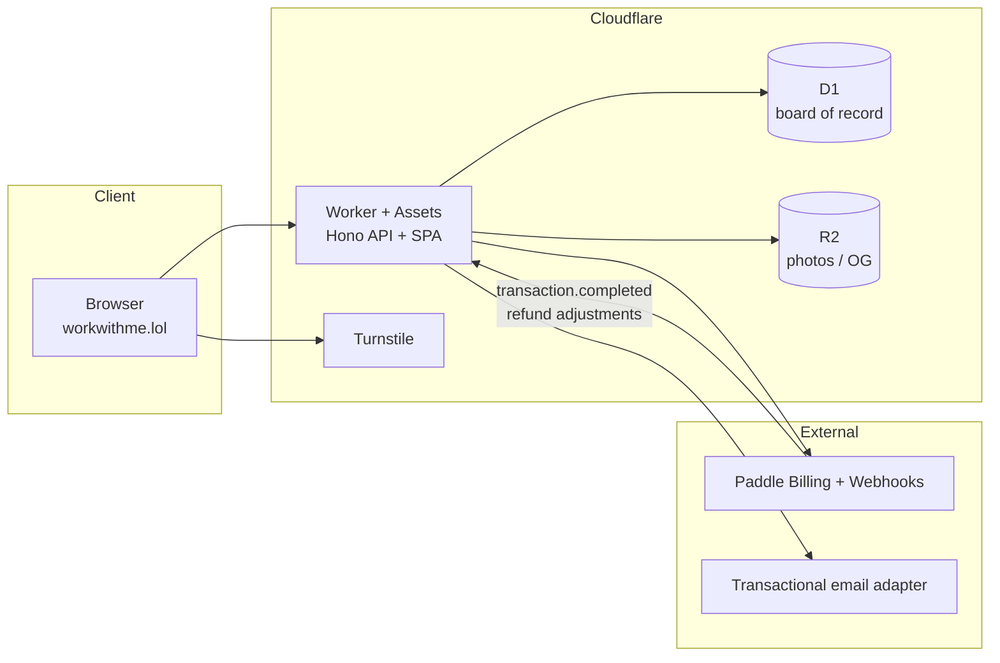
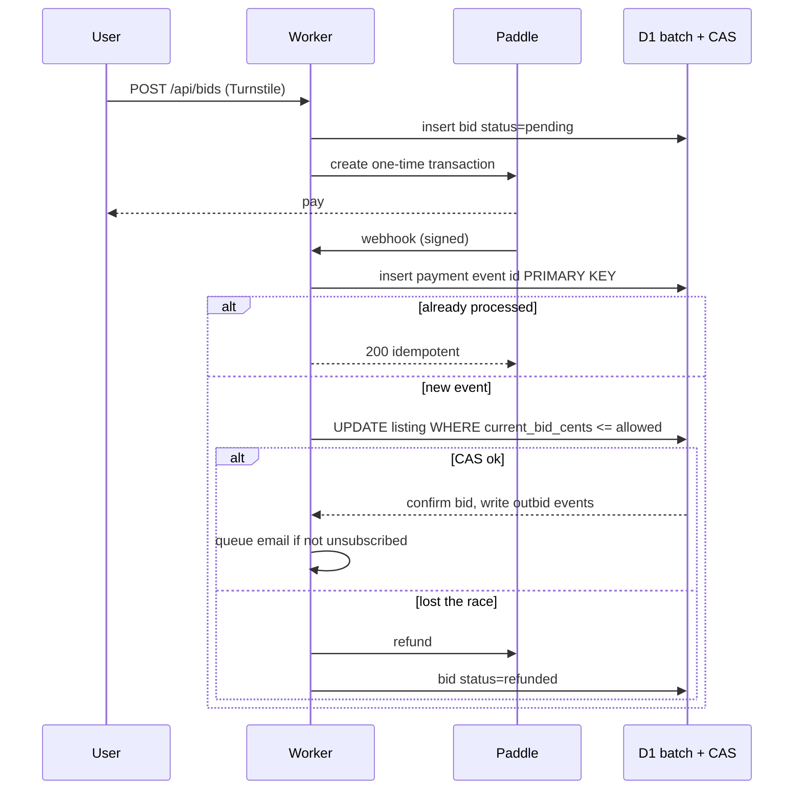

# Architecture

Cloudflare-native. One Worker is the origin for **https://workwithme.lol**.

---

## 1. Current Workers full-stack recommendation (confirmed 2026-08-21)

From [Cloudflare Workers docs](https://developers.cloudflare.com/workers/framework-guides/web-apps/react/) and the [Vite plugin](https://developers.cloudflare.com/workers/vite-plugin/):

- **Recommended path:** Vite + React SPA + a Worker API, wired with `@cloudflare/vite-plugin`, `assets.not_found_handling = "single-page-application"`.
- **API layer:** [Hono on Workers](https://developers.cloudflare.com/workers/framework-guides/web-apps/more-web-frameworks/hono/) — official guide scaffolds Hono + React + the Vite plugin.
- **SSR frameworks** (React Router / TanStack Start) are first-class on the Vite plugin. We are **not** using them for v1. This product is one board and a few pages. SPA + Worker routes is less moving surface. OG tags and share images are Worker routes (`/og/:handle`, HTMLRewriter or a small HTML shell), not a full SSR framework.

**Choice:** TypeScript + React + Tailwind + Vite + Hono Worker + Wrangler. shadcn primitives only if a control is faster than writing it; the board itself is custom.

**Not used (and why):**

| Thing | Why not |
| --- | --- |
| Vercel / Next.js | Workers is the origin. No compelling reason to add a second platform. |
| AWS / Firebase / Supabase | D1 + R2 cover SQL and images. Extra vendors are cost and drift. |
| Cloudflare Pages-as-app | Workers + Assets is the current full-stack target. |
| Durable Objects in v1 | See concurrency. We will add a DO only if CAS + `D1.batch` is not enough. |

---

## 2. Verified Cloudflare pieces

| Piece | Role | Notes |
| --- | --- | --- |
| Workers + Assets | Origin, API, SPA, `/og`, webhooks | Custom domain: `workwithme.lol` (+ `www` if we add it). |
| D1 | Source of truth | Listings, bids, users, events. `db.batch()` is a SQL transaction: statements run sequentially; a failure rolls back the batch. [Docs](https://developers.cloudflare.com/d1/worker-api/d1-database/#batch). |
| D1 Sessions | Sequential consistency if we enable read replicas | `withSession("first-primary")` for bid apply. Public board reads can be unconstrained later. |
| R2 | Profile photos, generated OG assets | No Images paid product required for v1. |
| Turnstile | Join / bid / magic-link request | Siteverify in the Worker. |
| Wrangler | Dev, migrations, deploy | `wrangler.jsonc` in repo. |
| Durable Objects | Optional later | Material for a single hot board only if we see refund storms from CAS races. Not in the first deploy. |

Paddle Billing is the only live payment provider. The Worker verifies `Paddle-Signature` and treats **webhook events as the commit**.

---

## 3. Domain and deploy target

**Production hostname: `workwithme.lol`.** Already purchased, already on Cloudflare nameservers. Attach the Worker as a [Custom Domain](https://developers.cloudflare.com/workers/configuration/routing/custom-domains/) (`routes[].custom_domain = true`). Do not use routes-in-front-of-an-origin; the Worker **is** the origin.

Public product name is **workwithme.lol** (same as the hostname). `hireme.lol` is parked (A `54.215.31.113` → parking Worker → merch). It is not ours. Never set it as a route, CORS origin, Paddle success URL, or OG canonical. Do not buy or attach it.

Local / preview: `http://localhost:5173` and `*.workers.dev`. CORS allowlist: `https://workwithme.lol`, `https://www.workwithme.lol`, localhost.

---

## 4. Diagram



Bid apply (authoritative path):



---

## 5. Concurrency and money

v1 is **one global board**. The hot row is “what is the current bid on listing X / what is #1.”

Plan:

1. Checkout inserts a `pending` bid. It does **not** move the board.
2. Webhook verifies Paddle, then:
   - Insert payment event `id = evt_...`. Duplicate primary key → **200, no second apply**.
   - In one `env.DB.batch([...])`, confirm the bid and CAS-update the listing (`WHERE current_bid_cents = ?` or `WHERE current_bid_cents < ?` depending on raise vs new).
   - Re-rank is a **read model**: `ORDER BY current_bid_cents DESC, current_bid_at ASC, profiles.created_at ASC`. We do not store rank as source of truth. We store `previous_rank` only for movement arrows.
3. A valid bid is always **≥ `min_entry_cents`** from `site_config` / `/api/config` (launch: **$2 to enter**). It places the listing wherever that number ranks. “Claim this rank for $X” is a UI price, not a separate product. Next rank = qualifying bid + **$2**. If two people pay the same amount, both stay; earlier `current_bid_at` is above.
4. Refunds: Paddle adjustment refund/chargeback webhooks, admin refunds, or CAS failure on a bid that cannot legally apply (amount below entry, or a raise that is not `min_increment_cents` over that listing’s own current bid). Launch increment is **+$2 to overtake**. Do not revert to $5 / +$1.

**Durable Objects:** a single `GlobalBoardCoordinator` would serialize applies. That helps only if we observe lost CAS + mass refunds. D1 batch already gives us an atomic transaction. We do not pay the DO complexity on day one.

Tests that must exist before money is live: ranking, ties, min bid, webhook idempotency, concurrent apply, refunds.

---

## 6. Auth, email, share, admin

- **Auth:** magic-link first (token hash in D1, HttpOnly session cookie). Google/GitHub OAuth can share the same `users` / `oauth_accounts` tables later. No LinkedIn sign-in.
- **Email:** Cloudflare Email Workers receive mail; they are a poor transactional sender. Use a thin `EmailProvider` (Resend or Mailgun HTTP from the Worker). Compelling reason: we will not stand up SES (AWS). Do not create a paid account in Travis’s name from this repo — wire the adapter and `.env.example` only.
- **Share / SEO:** `/{handle}` SPA route + Worker `run_worker_first` for `/og/*` and bot user-agents to inject OG. Images: Worker-generated PNG written to R2.
- **Admin:** `/admin` gated by `ADMIN_EMAILS`. Hide listing, refund, founding-badge, config (`min_entry_cents`, `min_increment_cents`).
- **Search:** SQL `LIKE` / FTS later; v1 ILIKE on name, handle, headline, company.
- **Analytics:** Cloudflare Web Analytics JS beacon only (`CF_WEB_ANALYTICS_TOKEN`, same snippet as docu-coach). Injected into HTML when set; omitted when missing. No Google Analytics or Clarity.

---

## 7. Repo structure

```text
.
├── PRODUCT.md
├── ARCHITECTURE.md
├── README.md
├── package.json
├── wrangler.jsonc          # name workwithme-lol, custom domain workwithme.lol
├── vite.config.ts
├── .env.example
├── migrations/
│   └── 0001_init.sql
├── index.html
├── public/
├── src/                    # React SPA
│   ├── main.tsx
│   ├── App.tsx
│   ├── index.css
│   ├── lib/                # shared with tests: ranking, money, types
│   ├── mock/               # founding-preview data only
│   ├── components/
│   └── pages/
├── worker/                 # Hono (API + webhook + OG later)
│   └── index.ts
└── tests/
```

Shared ranking code lives in `src/lib` so the preview board and future D1 reads cannot drift.

---

## 8. Phase plan

1. Docs, D1 schema, ranking tests, homepage shell.
2. **This slice:** magic-link (+ optional GitHub/Google), live board API, public `/{handle}`, Paddle one-time checkout + webhook-authoritative apply, outbid events + email, search, `/admin`, Wrangler deploy to `workwithme.lol`. Secret/setup held until Travis is ready.
3. Share/OG cards, R2 photo upload, Turnstile widgets in UI, production empty-board launch.

Local `npm run dev` runs the same Hono app as the Worker against `MemoryStore`. Production Worker uses `D1Store`. No fake listings in either path.

Do not attach paid infra beyond free Cloudflare / GitHub from this work. Do not register domains.
